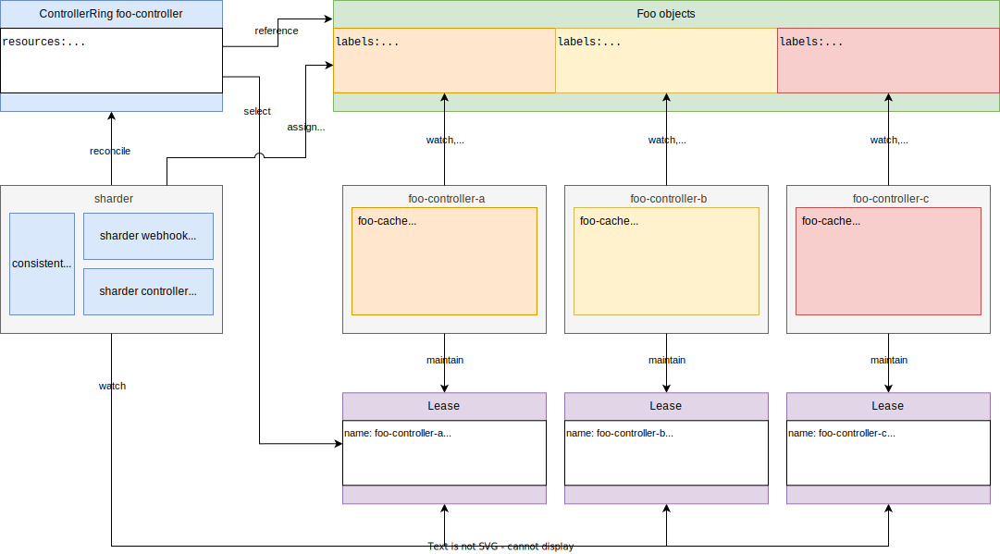

# Design

vvv

## Key Features

- Sharding mechanisms inspired by distributed databases
- Dynamic membership and failure detection
- Automatic failover and rebalancing
- Transparent label-based coordination
- Prevents concurrent reconciliations
- Reusable implementation

vvv

## Architecture

vvv

## Demo
