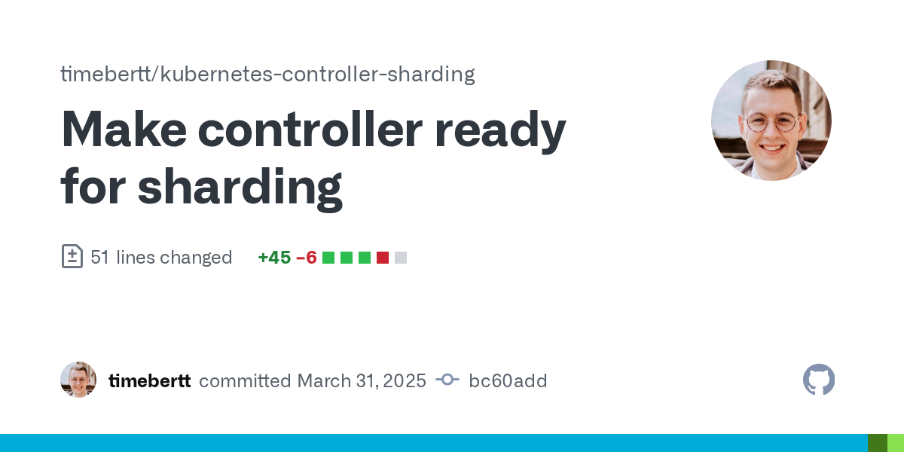

# Implementation

<!-- .slide: data-background-color="#daeaf9" -->

vvv

## 1) Install Sharding Components

```bash
kubectl apply --server-side –k \
  "https://github.com/timebertt/kubernetes-controller-sharding//config/default"
```

vvv

## 2) ControllerRing

```yaml [|7-8|9-14]
apiVersion: sharding.timebertt.dev/v1alpha1
kind: ControllerRing
metadata:
  name: webhosting-operator
spec:
  resources:
  - group: webhosting.timebertt.dev
    resource: websites
    controlledResources:
    - group: apps
      resource: deployments
    - group: networking.k8s.io
      resource: ingresses
    # ...
```

vvv

## 3) Shard Lease

```yaml [|5|6,9]
apiVersion: coordination.k8s.io/v1
kind: Lease
metadata:
  labels:
    alpha.sharding.timebertt.dev/controllerring: webhosting-operator
  name: webhosting-operator-65ffcdb674-8sst9
  namespace: webhosting-system
spec:
  holderIdentity: webhosting-operator-65ffcdb674-8sst9
  acquireTime: "2025-04-03T10:45:51.992779Z"
  renewTime: "2025-04-03T11:02:26.817751Z"
  leaseDurationSeconds: 15
```

vvv

## 3) Shard Lease (Go)

```go [1-6|8-16|9-11]
shardLease, err := shardlease.NewResourceLock(restConfig, shardlease.Options{
  ControllerRingName: "webhosting-operator",
})
if err != nil {
  return err
}

mgr, err := manager.New(restConfig, manager.Options{
  LeaderElection: true,
  LeaderElectionResourceLockInterface: shardLease,
  LeaderElectionReleaseOnCancel: true,
  // ...
})
if err != nil {
  return err
}
```

vvv

## 4) Filter Watch Cache
Only watch and reconcile objects with this label:

```yaml
shard.alpha.sharding.timebertt.dev/webhosting-operator: "<shard-name>"
```

vvv

## 4) Filter Watch Cache (Go)

```go [1-4|7-9]
labelSelector := labels.SelectorFromSet(labels.Set{
  // shard.alpha.sharding.timebertt.dev/webhosting-operator=<shard-name>
  shardingv1alpha1.LabelShard("webhosting-operator"): shardLease.Identity(),
})

mgr, err := manager.New(restConfig, manager.Options{
  Cache: cache.Options{
    DefaultLabelSelector: labelSelector,
  },
})
if err != nil {
  return err
}
```

vvv

## 5) Drain Operations

Stop reconciling objects with this label and remove the labels:

```yaml
drain.alpha.sharding.timebertt.dev/webhosting-operator: "true"
```

vvv

## 5) Drain Operations (Go)

<!-- .slide: data-auto-animate -->

```go [|3]
builder.ControllerManagedBy(mgr).
  For(&webhostingv1alpha1.Website{}, builder.WithPredicates(
    WebsitePredicate(),
  )).
  Owns(&appsv1.Deployment{}, builder.WithPredicates(DeploymentPredicate())).
  Complete(
    reconciler,
  )
```
<!-- .element: data-id="code-animation" -->

vvv

## 5) Drain Operations (Go)

<!-- .slide: data-auto-animate -->

```go [3|7]
builder.ControllerManagedBy(mgr).
  For(&webhostingv1alpha1.Website{}, builder.WithPredicates(
    shardcontroller.Predicate(controllerRing, shardName, WebsitePredicate()),
  )).
  Owns(&appsv1.Deployment{}, builder.WithPredicates(DeploymentPredicate())).
  Complete(
    reconciler,
  )
```
<!-- .element: data-id="code-animation" -->

vvv

## 5) Drain Operations (Go)

<!-- .slide: data-auto-animate -->

```go [7-11]
builder.ControllerManagedBy(mgr).
  For(&webhostingv1alpha1.Website{}, builder.WithPredicates(
    shardcontroller.Predicate(controllerRing, shardName, WebsitePredicate()),
  )).
  Owns(&appsv1.Deployment{}, builder.WithPredicates(DeploymentPredicate())).
  Complete(
    shardcontroller.NewShardedReconciler(mgr).
      For(&webhostingv1alpha1.Website{}).
      InControllerRing(controllerRing).
      WithShardName(shardName).
      MustBuild(reconciler),
  )
```
<!-- .element: data-id="code-animation" -->

vvv

## Summary

<!-- .slide: data-background-color="#495057" -->

<a href="https://github.com/timebertt/kubernetes-controller-sharding/commit/bc60add76f7fefe2b9f56414f570f9b36d3f03b4">

</a>
