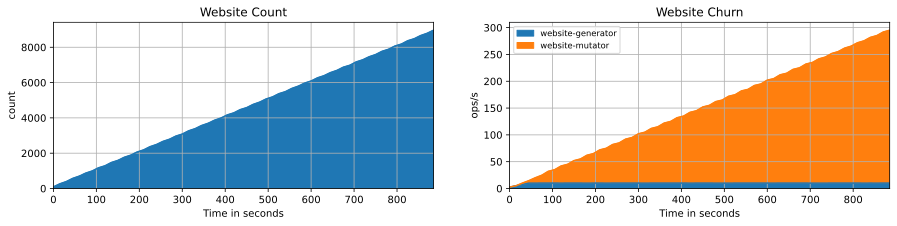
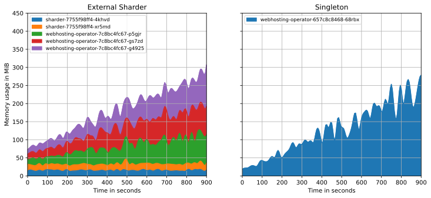
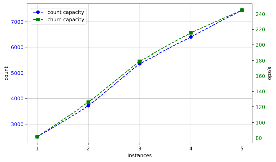

# Evaluation

vvv

## Load Tests

- Dimension 1: object count – up to 9,000 objects
- Dimension 2: object churn – up to 300 changes per second



vvv

## Resource Usage



vvv

## Performance Measurements

```yaml [|2-9|10-17]
queries:
# SLO 1: Queue Latency: p99 < 1s
- name: latency-queue
  query: |
    histogram_quantile(0.99, sum by (le) (
      workqueue_queue_duration_seconds_bucket{
        job="webhosting-operator", name="website"
      }
    ))
# SLO 2: Reconciliation Latency: p99 < 5s
- name: latency-reconciliation
  query: |
    histogram_quantile(0.99, sum by (le) (
      experiment_website_reconciliation_duration_seconds_bucket{
        job="experiment"
      }
    ))
```

vvv

## Load Capacity


