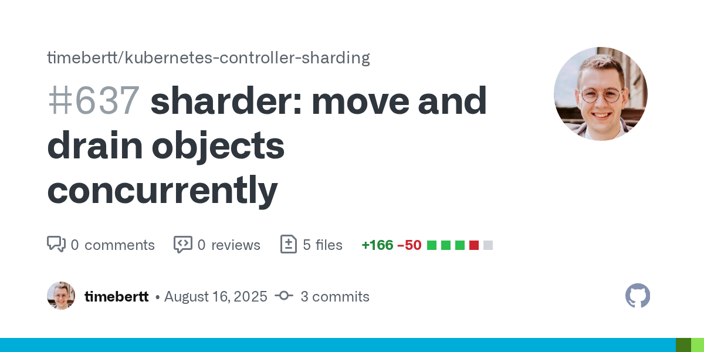
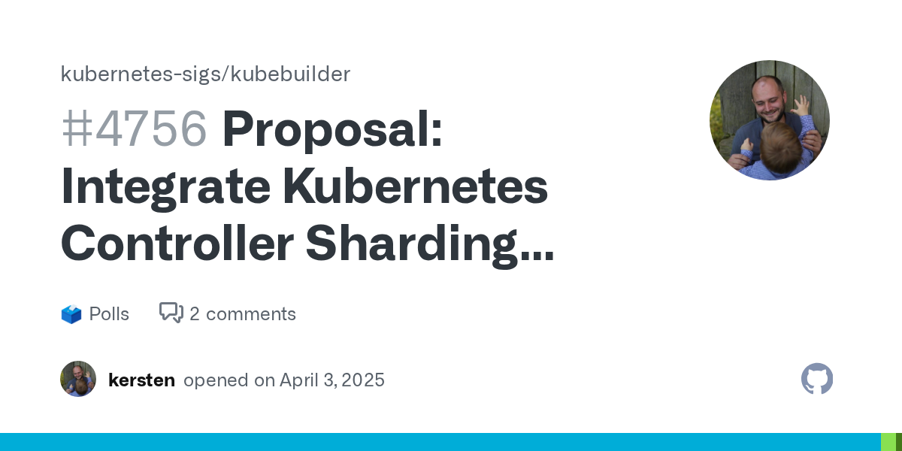
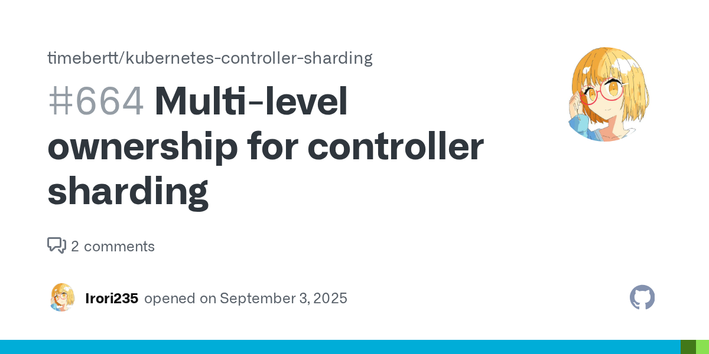
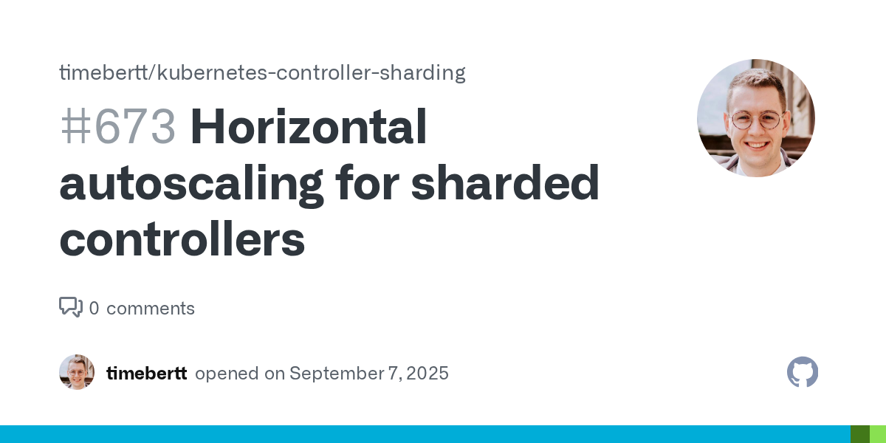

# What's New?

<!-- .slide: data-background-color="#daeaf9" -->

vvv

## Webhosting-Operator

Use `CreateOrPatch` instead of no-op `APPLY` calls

 

vvv

## Performance Improvements

Remove client-side rate limiting ([#610](https://github.com/timebertt/kubernetes-controller-sharding/pull/610)), 
Improve sharder retries ([#636](https://github.com/timebertt/kubernetes-controller-sharding/pull/636)), 
Move and drain objects concurrently ([#637](https://github.com/timebertt/kubernetes-controller-sharding/pull/637))

 

vvv

## Performance Improvements

| Scenario                    | sequential (before) | concurrent (after) |
|-----------------------------|---------------------|--------------------|
| Delete 1 random pod         | 3m49s               | 28s                |
| Scale down from 3 to 2 pods | 2m46s               | 17s                |
| Scale up from 2 to 3 pods   | 2m06s               | 17s                |
<!-- .element: class="table-no-wrap" -->

vvv

## Chaos Experiments

 

---

# What's Next?
## <em>Where You Can Help</em>

<!-- .slide: data-background-color="#daeaf9" -->

vvv

## Kubebuilder Plugin

vvv

## Partitioning by Owner of Owner

vvv

## Stabilize Rolling Updates

vvv

## Horizontal Autoscaling

